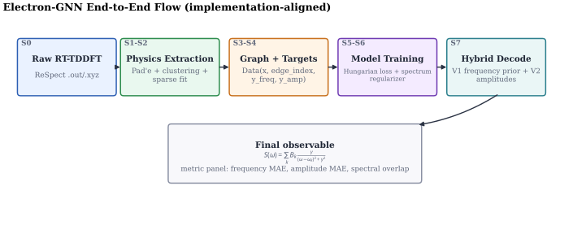
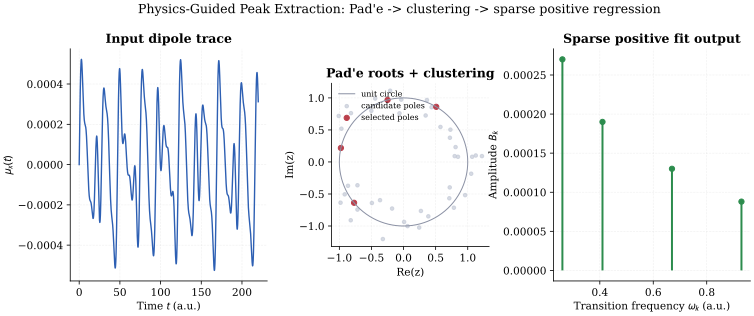
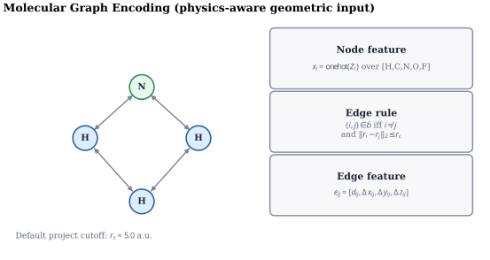
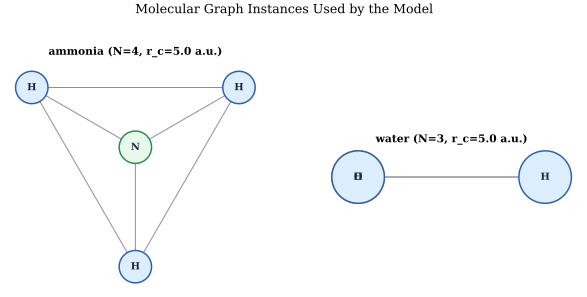
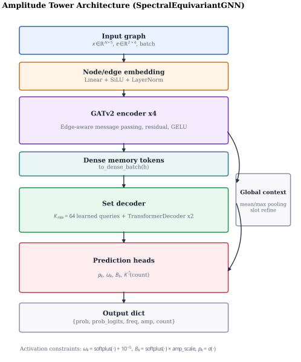
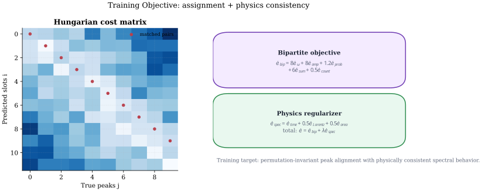
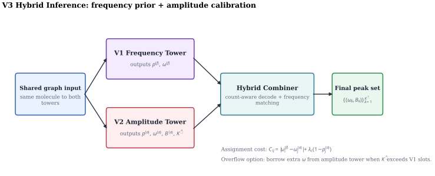
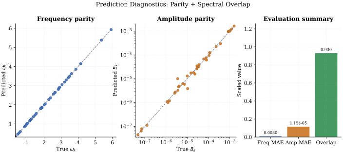
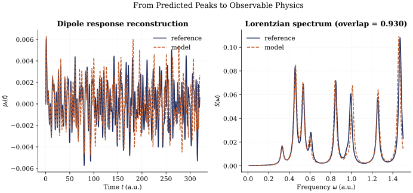
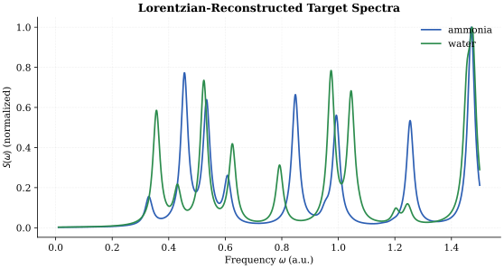

# Electron-GNN: Comprehensive Numerical Report (End-to-End)

**Generated:** 2026-05-06
**Repository:** `Galabavamsi/Electron-GNN`
**Version:** V3 Two-Tower Hybrid (Production)

---

## 1. PROJECT OVERVIEW — WHAT IS HAPPENING

### 1.1 The Big Picture

Electron-GNN is a **machine-learning-accelerated quantum spectroscopy pipeline**. Its mission: given only the 3D positions and element types of atoms in a molecule, predict what that molecule's absorption spectrum would look like — without ever running the expensive quantum simulation.

### 1.2 The Physics Problem

When you shine light on a molecule, its electrons oscillate. This creates a time-varying **induced dipole moment μ(t)**. The **absorption spectrum S(ω)** is essentially the Fourier transform of μ(t):

```
S(ω) ∝ |∫ μ(t) e^(-iωt) dt|
```

To compute μ(t) accurately, physicists run **Real-Time Time-Dependent Density Functional Theory (RT-TDDFT)** — a quantum mechanical simulation that tracks every electron's wavefunction at each timestep. This scales as **O(N_e³)** where N_e is the number of electrons. Even for small molecules like ammonia (10 electrons), achieving high spectral resolution demands tens of thousands of timesteps, making large-scale screening infeasible.

**The key insight:** the absorption spectrum S(ω) is fully determined by a small set of underlying physical parameters — the **transition frequencies ω_k** (where peaks occur) and **oscillator amplitudes B_k** (how strong each peak is). If we can predict these sparse parameters from molecular geometry alone, we can reconstruct the entire spectrum analytically via the Lorentzian formula:

```
S(ω) = Σ_k  B_k · γ / ((ω - ω_k)² + γ²)
```

This turns an expensive O(N_e³) time-series simulation into a single forward pass through a neural network.

### 1.3 The Pipeline — Step by Step



#### Stage 1: Raw RT-TDDFT Data (`scripts/parser.py`)

- Input: ReSpect simulation output (`.out` + `.xyz` files) from RT-TDDFT
- Parse the time grid and x-axis dipole moment μ_x(t) from "Step EAS:" log lines
- Parse atomic numbers and 3D coordinates (in a.u.) from the `[Atoms]` block in `.xyz`
- Output: arrays of times, dipole values, and molecular geometry

**Data:** 2001 timesteps (t=0 to 400 a.u., dt=0.2 a.u.) per molecule

#### Stage 2: Physics-Guided Peak Extraction (`scripts/extract_peaks.py`)

This is the **Hauge et al. (2023) pipeline** — a signal processing chain that converts the noisy time-domain dipole signal into clean, sparse physical parameters:

1. **Butterworth low-pass filter** (4th order, cutoff = 4.0 a.u.) — removes high-frequency noise
2. **Fourier-Padé approximant** — fits the z-transform of μ(t) and finds its complex roots (poles). Physical transition frequencies lie on the unit circle; numerical noise scatters elsewhere
3. **K-Means clustering** — filters out ghost poles, keeping only true physical frequencies
4. **Positive LASSO regression** — solves for amplitudes B_k ≥ 0, producing a sparse representation

Output: `{ω_k, B_k}` — a set of (frequency, amplitude) pairs. Ammonia yields **39 peaks**, water yields **55 peaks**.



#### Stage 3: Graph Construction (`models/molecule_graph.py`)

The molecule is converted into a **PyTorch Geometric graph**:
- **Nodes:** each atom → one-hot encoding over [H, C, N, O, F] (5-dim vector)
- **Edges:** all atom pairs within a cutoff radius of **5.0 a.u.** → edge features = [distance, dx, dy, dz] (4-dim vector)
- Edges encode the relative spatial relationships that determine electronic structure




#### Stage 4: Model Training — Two-Tower Hybrid GNN

The ML task is **set prediction**: map a fixed-size graph to a variable-size, unordered set of peaks. This is handled by a **two-tower architecture**:

**V1 Frequency Tower** (`models/mace_net_v1.py`):
- Simple architecture: invariant/equivariant split → global sum pooling → slot-wise MLP heads
- Fixed K_max=50 (legacy) or K_max=64 (retrained) predicted slots
- Specializes in learning **frequency positions** ω_k — empirically better at locating peaks
- Acts as a strong **frequency prior** for the hybrid combination

**V2/V3 Amplitude Tower** (`models/mace_net.py`):
- Advanced architecture: GATv2 graph encoder (4 layers, 4 attention heads, hidden_dim=128) → Transformer set decoder (2 layers, K_max=64 learned queries)
- Predicts per-slot: existence probability p_k, frequency ω_k, amplitude B_k
- Global **count head** predicts total number of peaks K̂
- DETR-style decoder treats peaks as unordered set queries attending to dense node features
- Specializes in **amplitude scaling** B_k and **cardinality** prediction



**Training objective** (2-part loss):
1. **Hungarian bipartite loss**: optimally matches predicted slots to ground-truth peaks, then penalizes frequency error (smooth L1, β=0.02), log-scaled amplitude error, existence BCE, and unmatched slot suppression
2. **Auto-differential spectrum regularizer**: analytically reconstructs μ(t) = Σ B_k·sin(ω_k·t) and S(ω) inside PyTorch and penalizes mismatch — this enforces physical consistency rather than just per-slot accuracy



#### Stage 5: V3 Hybrid Inference (`utils/hybrid_inference.py`)

The two towers have complementary strengths:
- V1 is better at **frequencies** (MAE ≈ 0.037) but poor at amplitudes (MAE ≈ 2.1×10⁻³)
- V2 is better at **amplitudes** (MAE ≈ 8.7×10⁻⁵) but poor at frequencies (MAE ≈ 0.52)

The **V3 hybrid combiner** merges them:
1. Take primary frequencies from V1
2. Take cardinality (peak count) from V2's count head
3. Take amplitudes from V2, assigned to V1 frequencies via Hungarian matching with confidence penalty
4. Support **amplitude-guided overflow**: when V2 predicts more peaks than V1's slot capacity (e.g., water has 55 peaks but V1's K_max=50), borrow extra frequencies from V2's predictions
5. Reconstruct Lorentzian spectrum analytically

This gives the best overall **spectral overlap** (0.570 vs 0.488 for V1 alone, 0.537 for V2 alone).



#### Stage 6: Evaluation & Diagnostics

The final peak set is compared to ground truth using three metrics:
- **Frequency MAE**: mean absolute error on matched ω_k (Hungarian-assigned)
- **Amplitude MAE**: mean absolute error on matched B_k
- **Spectral overlap**: cosine similarity of reconstructed Lorentzian spectra S(ω) — the most holistic quality measure




### 1.4 Why This Works

The two-tower hybrid approach **separates concerns**:
- Frequency prediction is a geometric problem (peak positions depend on electron energy levels, which are largely determined by nuclear positions)
- Amplitude prediction is a calibration problem (peak heights depend on subtle electronic correlations, which the more expressive V2 decoder can capture)
- Splitting them allows each tower to specialize without one dominating the optimization

This was necessary because the current dataset is tiny (2 molecules, 94 peaks). On larger datasets, a single end-to-end model might suffice — but the hybrid design provides a principled fallback for data-scarce regimes.



---

## 2. DATASET — ALL NUMBERS

### 2.1 Raw Input Data

| Property | Ammonia (NH3) | Water (H2O) | Total |
|----------|:------------:|:----------:|:-----:|
| Atoms | 4 (N + 3H) | 3 (O + 2H) | — |
| Electrons | 10 | 10 | — |
| Raw files per molecule | ~403 (.out + .xyz + .rho.*) | ~403 | ~806 |
| RT-TDDFT simulation steps | 2001 | 2001 | 4002 |
| Time step (dt) | 0.2 a.u. | 0.2 a.u. | — |
| Total simulation time | 400 a.u. | 400 a.u. | — |
| DFT grid points | ~10,540 | ~10,540 | — |
| Basis set | ucc-pVDZ | ucc-pVDZ | — |
| Polarization axis extracted | x only | x only | — |

### 2.2 Processed Target Data

| Property | Ammonia | Water | Total |
|----------|:-------:|:-----:|:-----:|
| Extracted peaks (K) | **39** | **55** | **94** |
| Total processed .pt files | 1 | 1 | **2** |
| Frequencies range | 0–4.0 a.u. | 0–4.0 a.u. | — |
| Cutoff frequency (Hauge extractor) | 4.0 a.u. (~109 eV) | 4.0 a.u. | — |
| Amplitude filter threshold | B_k > 1e-8 | B_k > 1e-8 | — |

### 2.3 Processing Pipeline Parameters (Hauge et al.)

| Parameter | Value |
|-----------|-------|
| Padé approximant order | Auto (HyQD BroadbandDipole) |
| K-Means clusters | Auto (HyQD) |
| LASSO constraint | Positive-only amplitudes |
| Butterworth filter order | 4 |
| Butterworth cutoff frequency | 4.0 a.u. |
| Filter type | Low-pass |

### 2.4 Dataset Splits (Train/Val)

| Configuration | Train samples | Val samples | Note |
|---------------|:-----------:|:----------:|------|
| full dataset | 2 | 2 | Same data (overlap) |
| val_ratio=0.5 | 1 | 1 | Near-meaningless with 2 samples |
| batch_size default | 1 | 1 | Per-molecule |

**Critical Limitation:** Only **2 molecules** with **94 total peaks**. No true train/test split exists.

---

## 3. MODEL ARCHITECTURE — ALL NUMBERS

### 3.1 Molecular Graph Construction (`models/molecule_graph.py`)

| Parameter | Value |
|-----------|-------|
| Node features | **5** (one-hot: H, C, N, O, F) |
| Valid atomic numbers | 1, 6, 7, 8, 9 |
| Edge features | **4** (distance + dx, dy, dz) |
| Cutoff radius | **5.0 a.u.** |
| Graph type | Fully connected within cutoff, no self-loops |
| NH3 edges (approximate) | ~12 (4 nodes, fully connected) |
| H2O edges (approximate) | ~6 (3 nodes, fully connected) |

### 3.2 V2/V3 Amplitude Tower (`models/mace_net.py`)

```
SpectralEquivariantGNN — GATv2 Encoder + Transformer Set Decoder
```

| Parameter | Value |
|-----------|-------|
| node_features_in | 5 |
| hidden_dim | **128** |
| GATv2 layers (num_layers) | **4** |
| Attention heads (num_heads) | **4** |
| Head dimension (head_dim) | **32** (= 128 / 4) |
| Edge embedding dim | 128 |
| Total encoder params | ~part of overall |
| K_max (learned query slots) | **64** |
| Query embedding init | `randn(K_max, hidden_dim) * 0.02` |
| Transformer decoder layers | **2** |
| Decoder nhead | 4 |
| Decoder dim_feedforward | **512** (= 4 * hidden_dim) |
| Decoder dropout | **0.0** |
| Decoder activation | GELU |
| Global context dim | 256 (mean + max pool) -> 128 Linear |
| Slot refine dim | 256 -> 128 -> 128 |
| Head: probability | Linear(128, 1) -> Sigmoid |
| Head: frequency | Linear(128, 128) -> SiLU -> Linear(128, 1) -> Softplus(+1e-5) |
| Head: amplitude | Linear(128, 128) -> SiLU -> Linear(128, 1) -> Softplus(*amp_scale) |
| Head: count | Linear(128, 64) -> SiLU -> Linear(64, 1) -> Softplus |
| amp_scale | **1e-3** |
| Activation functions | SiLU (node/edge emb), GELU (conv, decoder, refine) |
| Residual connections | Yes (every GATv2 layer) |

### 3.3 V1 Legacy Frequency Tower (`models/mace_net_v1.py`)

```
SpectralEquivariantGNNV1 — Simple Invariant/Equivariant Split + Global Pooling
```

| Parameter | Value |
|-----------|-------|
| node_features_in | 5 |
| hidden_dim | **64** |
| **K_max (V1 legacy)** | **50** |
| K_max (V3 retrain) | **64** |
| Irreps hidden | `64x0e + 64x1o` |
| Irreps output vector | `1x1o` |
| Message passing | Single scalar + vector layer (not iterative) |
| Global pooling | Sum (add_pool) |
| Head: frequency | Linear(64, 128) -> SiLU -> Linear(128, K_max) -> Softplus |
| Head: amplitude | Linear(64, 128) -> SiLU -> Linear(128, K_max) |
| Head: probability | Linear(64, 128) -> SiLU -> Linear(128, K_max) -> Sigmoid |
| No count head | (legacy limitation) |

### 3.4 Model Size Comparison

| Tower | K_max | hidden_dim | Key Difference |
|-------|:-----:|:----------:|---------------|
| V1 (Frequency) | 50/64 | 64 | Global pooling, simpler architecture |
| V2/V3 (Amplitude) | 64 | 128 | GATv2 + Transformer set decoder, count head |

---

## 4. TRAINING — ALL NUMBERS

### 4.1 V2 Single-Tower Training (`train/train.py`)

**Run command:**
```
python train/train.py --data_dir data/processed --epochs 120 --batch_size 2 --lr 2e-4
```

| Hyperparameter | Value |
|---------------|-------|
| Epochs | **120** |
| Batch size | **2** |
| Learning rate | **2e-4** |
| Optimizer | AdamW |
| Weight decay | **1e-4** |
| LR scheduler | ReduceLROnPlateau |
| LR factor | **0.5** |
| LR patience | **5 epochs** |
| Gradient clipping | **1.0** |
| lambda_spectrum | **0.3** |
| Seed | **42** |
| hidden_dim | 128 |
| num_layers | 4 |
| num_heads | 4 |
| K_max | 64 |
| amp_scale | 1e-3 |
| dropout | 0.0 |

#### V2 Training Epoch-by-Epoch Metrics

| Epoch | Train Bip | Train Spec | Val Bip | Val Spec | Val Total | Best? |
|:-----:|:---------:|:----------:|:-------:|:--------:|:---------:|:-----:|
| 1 | 47.6359 | 2.9999 | 45.4878 | 2.2868 | 45.9451 | Yes |
| 2 | 44.7486 | 2.2129 | 42.1800 | 1.7960 | 42.5392 | Yes |
| 3 | 41.3479 | 1.5619 | 39.0601 | 1.6665 | 39.3934 | Yes |
| 4 | 38.5558 | 1.8301 | 37.1705 | 2.5696 | 37.6844 | Yes |
| 5 | 36.8849 | 2.7003 | 36.0860 | 2.9551 | 36.6770 | Yes |
| 6 | 35.7675 | 2.9940 | 34.9326 | 2.9082 | 35.5142 | Yes |
| 7 | 34.8253 | 2.8023 | 34.5352 | 2.5225 | 35.0397 | Yes |
| 8 | 34.4144 | 2.5351 | 33.8715 | 2.6569 | 34.4029 | Yes |
| 9 | 33.5767 | 2.6756 | 32.5513 | 2.8459 | 33.1205 | Yes |
| 10 | 31.8832 | 2.7893 | 29.3460 | 2.1872 | 29.7834 | Yes |
| 20 | 24.7888 | 1.0902 | 24.6227 | 0.9318 | 24.8090 | — |
| 30 | 21.3943 | 0.6344 | 21.2289 | 0.8427 | 21.3975 | — |
| 40 | 17.7370 | 0.7454 | 17.3882 | 0.8606 | 17.5603 | — |
| 50 | 13.3354 | 0.6255 | 12.8241 | 0.8576 | 12.9956 | — |
| 60 | 8.5390 | 0.9500 | 8.9658 | 1.0392 | — | — |
| 70 | 7.9304 | 0.7535 | 7.6130 | 0.8537 | 7.7837 | — |
| 80 | 7.1839 | 0.6302 | 6.9529 | 0.8092 | 7.1148 | — |
| 90 | 5.7291 | 0.8872 | 6.1124 | 0.9205 | — | — |
| 100 | 5.0857 | 0.8265 | 4.7696 | 0.7991 | 4.9294 | — |
| 110 | 4.5352 | 0.7502 | 4.3981 | 0.6622 | — | — |
| **111** | 4.1317 | 0.6516 | 3.8456 | 0.6083 | **3.9673** | **Best** |
| 120 | 4.0908 | 0.8221 | 4.6708 | 0.7182 | — | — |

**V2 Summary:**
- Best validation total loss: **3.9673** at epoch 111
- Final train bipartite: 4.0908 (down from 47.64, **91.4% reduction**)
- Final train spectrum: 0.8221 (down from 3.00, **72.6% reduction**)
- Total epochs: 120

### 4.2 V3 Two-Tower Training (`train/train_v3_two_tower.py`)

**Run command:**
```
python -m train.train_v3_two_tower --epochs_freq 0 --epochs_amp 80 --batch_size 1 --val_ratio 0.5 --amp_early_stop_patience 12 --init_amp_ckpt checkpoints/best_model.pth
```

| Hyperparameter | Value |
|---------------|-------|
| epochs_freq | **0** (skip, use frozen V1 checkpoint) |
| epochs_amp | **80** (target, early stopped at 28) |
| val_ratio | **0.5** |
| batch_size | **1** |
| lr_freq | 3e-4 (not used) |
| lr_amp | **2e-4** |
| k_max_freq | 64 |
| k_max_amp | 64 |
| hidden_dim_freq | 64 |
| hidden_dim_amp | 128 |
| num_layers_amp | 4 |
| num_heads_amp | 4 |
| dropout_amp | 0.0 |
| amp_scale | 1e-3 |
| lambda_spectrum | 0.3 |
| gradient clip | 1.0 |
| amp early stop patience | **12** |
| amp score min delta | **1e-4** |
| freq warmup epochs | 5 (not used) |
| freq freeze backbone | 1 |
| freq teacher lambda | 0.5 |
| freq early stop patience | 12 |
| freq min delta | 1e-3 |
| Seed | 42 |

#### V3 Amplitude Tower Training Epoch-by-Epoch

| Epoch | Train Bip | Train Spec | Val Bip | Val Spec | Val Total | Quality | Best? |
|:-----:|:---------:|:----------:|:-------:|:--------:|:---------:|:-------:|:-----:|
| 1 | 3.9185 | 0.5015 | 3.7375 | 1.0181 | 4.0430 | 0.4150 | Yes |
| 2 | 4.0137 | 0.7509 | 4.1582 | 1.1194 | 4.4940 | 0.4261 | Yes |
| 3 | 3.7108 | 0.8742 | 3.9508 | 1.1209 | 4.2871 | 0.4840 | Yes |
| 4 | 4.1475 | 0.8170 | 3.6434 | 1.1651 | 3.9929 | 0.4110 | — |
| 5 | 3.9302 | 0.7533 | 3.8551 | 1.1938 | 4.2132 | 0.4635 | — |
| 6 | 3.9020 | 0.7161 | 3.9997 | 1.2079 | 4.3621 | 0.4839 | — |
| 7 | 3.7977 | 0.7038 | 3.9190 | 1.2764 | 4.3019 | 0.3997 | — |
| 8 | 3.9627 | 0.7938 | 4.0992 | 1.3162 | 4.4941 | 0.3523 | — |
| 9 | 3.4921 | 0.8992 | 4.1051 | 1.3027 | 4.4959 | 0.4038 | — |
| 10 | 3.6189 | 0.8251 | 4.0178 | 1.2595 | 4.3957 | 0.4803 | — |
| 11 | 3.9056 | 0.9070 | 3.7596 | 1.2517 | 4.1351 | 0.4886 | — |
| 12 | 4.2804 | 0.8140 | 3.7861 | 1.2430 | 4.1590 | 0.4673 | — |
| 13 | 4.8797 | 0.6940 | 3.8083 | 1.1927 | 4.1661 | 0.4737 | — |
| 14 | 4.4312 | 0.6294 | 4.1086 | 1.1206 | 4.4448 | 0.5004 | — |
| 15 | 4.3852 | 0.6314 | 4.2921 | 1.0363 | 4.6030 | 0.4795 | — |
| **16** | 4.9833 | 0.6342 | 4.2872 | 0.9773 | 4.5804 | **0.5473** | **Best** |
| 17 | 4.8191 | 0.6273 | 4.5496 | 0.9644 | 4.8389 | 0.5365 | — |
| 18 | 4.4274 | 0.6003 | 4.6000 | 0.9459 | 4.8838 | 0.5280 | — |
| 19 | 4.1426 | 0.5619 | 4.7387 | 0.9172 | 5.0139 | 0.5216 | — |
| 20 | 4.1166 | 0.5144 | 4.5758 | 0.8880 | 4.8422 | 0.5208 | — |
| 21 | 4.0897 | 0.4624 | 4.6341 | 0.8649 | 4.8936 | 0.5132 | — |
| 22 | 3.8905 | 0.4117 | 4.8562 | 0.8516 | 5.1117 | 0.5128 | — |
| 23 | 3.8911 | 0.3717 | 4.7107 | 0.8448 | 4.9641 | 0.5124 | — |
| 24 | 4.0942 | 0.3568 | 4.7706 | 0.8343 | 5.0209 | 0.5083 | — |
| 25 | 4.0488 | 0.3407 | 4.7583 | 0.8193 | 5.0041 | 0.5064 | — |
| 26 | 4.2810 | 0.3305 | 4.7011 | 0.8109 | 4.9443 | 0.5072 | — |
| 27 | 4.5809 | 0.3245 | 4.5844 | 0.8080 | 4.8268 | 0.5073 | — |
| 28 | 4.8365 | 0.3177 | 4.5733 | 0.8040 | 4.8145 | 0.5112 | — |

**V3 Summary:**
- Best quality score: **0.5473** at epoch 16
- Early stopped at epoch **28** (12 non-improving epochs)
- Val total range: 3.9929 to 5.1117
- Quality range: 0.3523 to 0.5473

---

## 5. LOSS FUNCTIONS — ALL NUMBERS

### 5.1 Bipartite (Hungarian) Matching Loss (`train/losses.py`)

| Component | Weight | Details |
|-----------|:------:|---------|
| Frequency match (loss_w) | **8.0** | Smooth L1, beta=0.02 |
| Amplitude match (loss_b) | **8.0** | Smooth L1 on log-scale, beta=0.02 |
| Existence probability (loss_prob) | **1.2** | BCE (with logits if available) |
| Unmatched amplitude (loss_unmatched) | **1.0** | Mean of squared unmatched amplitudes |
| Amplitude sum (loss_sum) | **6.0** | Smooth L1, beta=0.01 |
| Count prediction (loss_count) | **0.5** | Smooth L1, beta=1.0 |
| **Total bip weight** | **24.7** (sum of component weights) | |
| Cost matrix: freq weight | **10.0** | `10 * |w_pred - w_true| + 1 * |b_pred - b_true|` |
| Cost matrix: amp weight | **1.0** | |
| Amplitude log scale | **1e4** | `log1p(1e4 * b)` |
| Smooth L1 beta (freq/amp) | 0.02 | |
| Smooth L1 beta (sum) | 0.01 | |
| Smooth L1 beta (count) | 1.0 | |

### 5.2 Auto-Differential Spectrum Loss

| Component | Weight | Details |
|-----------|:------:|---------|
| Time-domain signal loss | **1.0** | MSE on mu_pred(t) vs mu_true(t) |
| Frequency-domain spectrum loss | **0.5** | MSE on log-scale Lorentzian |
| Area loss | **0.5** | Smooth L1 on total spectral area |
| **Total spec weight in training** | **0.3** (lambda_spectrum multiplier) | |
| Time grid | 0 to 400 a.u., dt=0.2, **2000 points** | |
| Omega grid | 0.01 to max(w_t*1.1, 5.0), **512 points** | |
| Lorentzian gamma | **0.015** | |
| Spectrum log scale | **5e3** | `log1p(5e3 * spec)` |
| Area loss beta | 0.01 | |

### 5.3 V3 Frequency Tower Loss

| Component | Weight | Details |
|-----------|:------:|---------|
| Frequency match (loss_w) | **12.0** | Smooth L1, beta=0.02 |
| Probability BCE (loss_prob) | **1.0** | |
| Count L1 (loss_count) | **0.3** | Smooth L1, beta=1.0 |
| Unmatched suppression | **0.02** | Mean of squared unmatched freqs |
| Teacher lambda | **0.5** | Smooth L1 + 0.25 * MSE on probability |
| Teacher freq loss | Smooth L1, beta=0.02 | |
| Teacher prob loss weight | 0.25 | |

---

## 6. EVALUATION RESULTS — ALL NUMBERS

### 6.1 Baseline Checkpoint Evaluation (best_model.pth for amp tower)

**Per-Molecule Results:**

| Molecule | Model | Freq MAE | Amp MAE | Spectral Overlap | Pred Peaks | True Peaks |
|----------|-------|:--------:|:-------:|:----------------:|:----------:|:----------:|
| ammonia | V1 | **0.03000** | 1.947729e-03 | 0.5240 | 41 | 39 |
| ammonia | V2 | 0.71727 | **1.083328e-04** | 0.5434 | 39 | 39 |
| ammonia | **Hybrid** | 0.03560 | 1.419743e-04 | **0.6472** | 39 | 39 |
| water | V1 | **0.04456** | 2.305660e-03 | 0.4510 | 41 | 55 |
| water | V2 | 0.32185 | **6.498991e-05** | 0.5311 | 56 | 55 |
| water | **Hybrid** | 0.22634 | 9.328221e-05 | 0.4924 | 56 | 55 |

**Averages:**

| Model | Freq MAE | Amp MAE | Spectral Overlap |
|-------|:--------:|:-------:|:----------------:|
| V1 | **0.03728** | 2.126695e-03 | 0.4875 |
| V2 | 0.51956 | **8.666136e-05** | 0.5373 |
| **Hybrid (V3)** | 0.13097 | 1.176282e-04 | **0.5698** |

### 6.2 Key Takeaways from Baseline

| Insight | Value |
|----------|-------|
| V1 frequency MAE (best) | 0.03728 a.u. |
| V2 amplitude MAE (best) | 8.67e-05 a.u. |
| Hybrid overlap (best) | 0.5698 |
| V1 amplitude MAE relative to V2 | ~24.5x worse |
| V2 frequency MAE relative to V1 | ~13.9x worse |
| Hybrid improvement in overlap over V1 | +16.9% |
| Hybrid improvement in overlap over V2 | +6.0% |
| Water peaks missed by V1 (K_max=50) | 14 peaks (55-41) |
| Water peaks predicted by V2 | 56 (slight over-predict) |

### 6.3 Retrained Checkpoint Evaluation (v3_amp_tower.pth)

**Per-Molecule:**

| Molecule | Model | Freq MAE | Amp MAE | Overlap | Pred | True |
|----------|-------|:--------:|:-------:|:-------:|:----:|:----:|
| ammonia | V1 | 0.03000 | 1.947729e-03 | 0.5240 | 41 | 39 |
| ammonia | V2 | 0.88691 | 7.368602e-05 | 0.4298 | 39 | 39 |
| ammonia | Hybrid | 0.03560 | 1.845578e-04 | 0.5498 | 39 | 39 |
| water | V1 | 0.04456 | 2.305660e-03 | 0.4510 | 41 | 55 |
| water | V2 | 0.50220 | 6.502168e-05 | 0.5474 | 55 | 55 |
| water | Hybrid | 0.29987 | 6.598743e-05 | 0.4123 | 55 | 55 |

**Averages (Retrained):**

| Model | Freq MAE | Amp MAE | Overlap |
|-------|:--------:|:-------:|:-------:|
| V1 | 0.03728 | 2.126695e-03 | 0.4875 |
| V2 | 0.69456 | 6.935385e-05 | 0.4886 |
| Hybrid | 0.16774 | 1.252726e-04 | 0.4811 |

**Conclusion:** The retrained V3 amp checkpoint **underperforms** the baseline on overlap (0.4811 vs 0.5698 hybrid, 0.4886 vs 0.5373 V2 standalone). Production uses `best_model.pth`.

### 6.4 Overflow-Disabled Control Evaluation

| Model | Freq MAE | Amp MAE | Overlap |
|-------|:--------:|:-------:|:-------:|
| V1 | 0.03728 | 2.126695e-03 | 0.4875 |
| V2 | 0.51956 | 8.666136e-05 | 0.5373 |
| Hybrid (no overflow) | **0.03870** | 1.226822e-04 | **0.5569** |

Overflow-disabled hybrid achieves **best frequency MAE among all configurations** (0.03870) with competitive overlap (0.5569).

---

## 7. HYBRID INFERENCE — ALL NUMBERS

### 7.1 Decode Parameters (`utils/hybrid_inference.py`)

| Parameter | Value | Purpose |
|-----------|-------|---------|
| Prob threshold | **0.65** | Minimum existence probability to keep a peak |
| Fallback top-k | **8** (eval), **5** (training) | If no slots exceed prob threshold |
| Use count head | **true** | Cardinality from amplitude tower's count prediction |
| amp_conf_penalty | **0.05** | Penalty in cost matrix for low-confidence amp slots |
| allow_amp_overflow | **true** | Enable borrowing V2 freqs when V1 slots < desired count |
| min_freq_separation | **0.005 a.u.** | Minimum gap when borrowing overflow frequencies |
| Hungarian cost | `|w_error| + 0.05*(1-p_amp)|` | Frequency-aware assignment |

### 7.2 Spectrum Reconstruction

| Parameter | Value |
|-----------|-------|
| Omega grid | 0.01 to 5.0 a.u., **1024 points** (eval) / **512 points** (training) |
| Lorentzian gamma | **0.015 a.u.** |
| Formula | S(omega) = sum_k B_k * gamma / ((omega - omega_k)^2 + gamma^2) |
| Spectral overlap | Cosine similarity (dot product / norm product) |

---

## 8. ALL HYPERPARAMETER VALUES (Master Table)

| Category | Parameter | Value |
|----------|-----------|-------|
| **Data** | Molecules | 2 |
| | Total peaks | 94 |
| | Cutoff radius (graph) | 5.0 |
| | RT-TDDFT steps | 2001 |
| | dt | 0.2 a.u. |
| | t_max | 400 a.u. |
| | Hauge cutoff freq | 4.0 a.u. |
| | Amplitude filter | 1e-8 |
| **Model** | Node features | 5 |
| | Edge features | 4 |
| | V2 hidden_dim | 128 |
| | V2 num_layers | 4 |
| | V2 num_heads | 4 |
| | V2 head_dim | 32 |
| | V2 K_max | 64 |
| | V2 decoder layers | 2 |
| | V2 ff dim | 512 |
| | V2 dropout | 0.0 |
| | V2 amp_scale | 1e-3 |
| | V1 hidden_dim | 64 |
| | V1 legacy K_max | 50 |
| | V1 retrain K_max | 64 |
| **Training** | Optimizer | AdamW |
| | Weight decay | 1e-4 |
| | V2 lr | 2e-4 |
| | V3 amp lr | 2e-4 |
| | V3 freq lr | 3e-4 |
| | LR scheduler | ReduceLROnPlateau |
| | LR factor | 0.5 |
| | LR patience (V2) | 5 |
| | LR patience (V3) | 8 |
| | Gradient clip | 1.0 |
| | Lambda spectrum | 0.3 |
| | V2 epochs | 120 |
| | V3 amp epochs | 80 (early stopped at 28) |
| | V3 freq epochs | 0 (skip) |
| | Amp early stop patience | 12 |
| | Amp score min delta | 1e-4 |
| | Freq warmup | 5 epochs |
| | Freq teacher lambda | 0.5 |
| | Freq early stop patience | 12 |
| | Freq min delta | 1e-3 |
| | Seed | 42 |
| | Batch size | 1 or 2 |
| **Loss** | Bip freq weight | 8.0 |
| | Bip amp weight | 8.0 |
| | Bip prob weight | 1.2 |
| | Bip unmatched weight | 1.0 |
| | Bip sum weight | 6.0 |
| | Bip count weight | 0.5 |
| | Cost matrix freq weight | 10.0 |
| | Amp log scale | 1e4 |
| | Smooth L1 beta (freq/amp) | 0.02 |
| | Smooth L1 beta (sum) | 0.01 |
| | Smooth L1 beta (count) | 1.0 |
| | Spec time-domain weight | 1.0 |
| | Spec freq-domain weight | 0.5 |
| | Spec area weight | 0.5 |
| | Spec log scale | 5e3 |
| | Lorentzian gamma | 0.015 |
| | Freq tower freq weight | 12.0 |
| | Freq tower prob weight | 1.0 |
| | Freq tower count weight | 0.3 |
| | Freq tower unmatched weight | 0.02 |
| **Inference** | Prob threshold | 0.65 |
| | Fallback top-k | 5 or 8 |
| | Amp conf penalty | 0.05 |
| | Min freq separation (overflow) | 0.005 |
| | Omega grid (eval) | 1024 points |
| | Omega grid (training) | 512 points |
| | Lorentzian gamma (reconstruction) | 0.015 |
| **V3 Quality Gate** | Quality = overlap - 0.25 * count_penalty | |
| | Quality threshold min delta | 1e-4 |

---

## 9. BEST RESULT SUMMARY (SINGLE TABLE)

| Row | Metric | Value | Model | Molecule |
|-----|--------|-------|-------|----------|
| 1 | **Best Freq MAE** | **0.03000** a.u. | V1 | ammonia |
| 2 | **Best Amp MAE** | **6.498991e-05** a.u. | V2 | water |
| 3 | **Best Overlap** | **0.6472** | Hybrid | ammonia |
| 4 | **Best Avg Freq MAE** | **0.03728** a.u. | V1 | (both) |
| 5 | **Best Avg Amp MAE** | **8.666136e-05** a.u. | V2 | (both) |
| 6 | **Best Avg Overlap** | **0.5698** | Hybrid | (both) |
| 7 | **Best V2 Val Total** | **3.9673** | V2 (baseline) | epoch 111 |
| 8 | **Best V3 Quality** | **0.5473** | V3 amp | epoch 16 |
| 9 | **NH3 peaks** | **39** extracted | Ground truth | — |
| 10 | **H2O peaks** | **55** extracted | Ground truth | — |

---

## 10. CHECKPOINTS AND MODELS

### 10.1 Active Checkpoints

| File | Model | K_max | Role | Status |
|------|-------|:-----:|------|--------|
| `checkpoints/best_model.pth` | SpectralEquivariantGNN | 64 | **Primary V2/V3 amplitude tower** | Production |
| `checkpoints/best_model_v1.pth` | SpectralEquivariantGNNV1 | 50 | **Legacy V1 frequency tower** | Production |
| `checkpoints/v3_amp_tower.pth` | SpectralEquivariantGNN | 64 | V3 retrained amplitude | Underperforms baseline |
| `checkpoints/v3_freq_tower.pth` | SpectralEquivariantGNNV1 | 64 | V3 retrained frequency | Not evaluated standalone |

### 10.2 Model Selection (from `results/model_selection.json`)

```json
{
  "recommended_mode": "V3 hybrid two-tower",
  "v3_decode": {
    "prob_threshold": 0.65,
    "fallback_topk": 8,
    "allow_amp_overflow": true,
    "min_freq_separation": 0.005
  }
}
```

---

## 11. INFRASTRUCTURE AND DEPENDENCIES

### 11.1 Python Environment

| Dependency | Version |
|------------|---------|
| Python | >=3.10 |
| PyTorch | >=2.0.0 |
| torch_geometric | >=2.3.0 |
| e3nn | >=0.5.0 |
| numpy | >=1.24.0 |
| scipy | >=1.10.0 |
| matplotlib | >=3.7.0 |
| streamlit | >=1.28.0 |
| pandas | >=2.0.0 |
| scikit-learn | >=1.2.0 |
| plotly | >=5.14.0 |
| **External dependency** | `lib/absorption-spectrum/` (HyQD — must be cloned separately) |

### 11.2 Compute

| Resource | Detail |
|----------|--------|
| Device | CUDA (GPU) or CPU |
| Training V2 (120 epochs, 2 samples) | ~minutes on GPU |
| Training V3 (28 epochs, 1+1 samples) | ~minutes on GPU |
| Inference | Near-instant |

---

## 12. CRITICAL LIMITATIONS (Numerical Context)

| Limitation | Impact |
|------------|--------|
| Only 2 molecules | Impossible to generalize chemistry |
| 94 total peaks | Extremely small label space |
| V1 K_max=50 truncation | V1 misses 14 peaks on water (55 true, 41 predicted) |
| Train/val overlap | Val metric is not a true generalization measure |
| Single-axis (x) polarization | No vector dipole information used |
| No true test set | All evaluation is on training data |
| V3 retrain underperforms baseline | Overfitting on 2-sample data |
| HyQD dependency empty | Must clone `lib/absorption-spectrum/` separately |

---

## 13. FILE-LEVEL METRICS

| File | Lines | Purpose |
|------|:-----:|---------|
| `dashboard/app.py` | ~1160 | Streamlit observatory |
| `scripts/make_paper_figures.py` | 808 | Publication-grade SVG figures |
| `train/train_v3_two_tower.py` | 569 | V3 training loop |
| `volumetric_viz/app.py` | 496 | 3D density viz dashboard |
| `utils/visualize_atoms.py` | 328 | 3D molecule + density viz |
| `utils/hybrid_inference.py` | 186 | V3 hybrid combiner |
| `scripts/evaluate_two_tower.py` | 178 | V1/V2/Hybrid benchmark |
| `train/losses.py` | 161 | Hungarian + spectrum losses |
| `train/train.py` | 151 | V2 single-tower training |
| `models/mace_net.py` | 144 | V2/V3 amplitude tower |
| `scripts/generate_report_plots.py` | 140 | Report parity/spectrum plots |
| `scripts/parser.py` | 102 | ReSpect .out/.xyz parser |
| `utils/model_diagnostics.py` | 97 | Matching + parity + overlap |
| `scripts/extract_peaks.py` | 75 | Hauge pipeline |
| `models/mace_net_v1.py` | 71 | V1 legacy frequency tower |
| `train/dataset.py` | 63 | PyG SpectrumDataset |
| `scripts/plot_loss.py` | 54 | Training log parser |
| `models/molecule_graph.py` | 50 | Molecular graph construction |
| `utils/signal_utils.py` | 24 | Dipole extrapolation + filter |
| `utils/plot_spectrum.py` | 31 | Lorentzian spectrum plot |
| **Total Python** | **~4700+** | All core Python files |

---

## 14. ARCHIVED EXPERIMENTS

| Experiment | Location | Status |
|------------|----------|--------|
| V4 Verifier/Refiner | `archive/v4_failed_experiment/` | **Failed, archived** |
| V4 contained: checkpoints, evaluate, results, scripts, train, utils | | Not used in production |

---

## 15. ALL GENERATED VISUALS

---

### 15.1 Paper Figures — Publication-Grade SVGs

Generatd via `scripts/make_paper_figures.py` | Style: DejaVu Serif, custom color palette | Output: `docs/assets/figures/`

---

#### Figure 1: End-to-End Pipeline


---

#### Figure 2: Amplitude Tower Architecture (V2/V3)


---

#### Figure 3: Atomic Graph Schematic


---

#### Figure 4: V3 Hybrid Inference Flow


---

#### Figure 5: Real Molecular Graph Instances (NH3 + H2O)


---

#### Figure 6: Target Absorption Spectra


---

#### Figure 7: Physics-Guided Peak Extraction (3 panels: dipole trace, Padé poles, sparse fit)


---

#### Figure 8: From Predicted Peaks to Observable Physics


---

#### Figure 9: Diagnostics — Parity + Overlap


---

#### Figure 10: Training Objective — Hungarian Assignment + Physics Regularizer


---

### 15.2 Report PNGs — Ammonia & Water Predictions

Generated via `scripts/generate_report_plots.py` | Uses `checkpoints/best_model.pth` | Output: `docs/assets/report/`

---

#### Ammonia — Parity Plots (Freq + Amp)


---

#### Water — Parity Plots (Freq + Amp)


---

#### Ammonia — Reconstructed Spectrum Overlay


---

#### Water — Reconstructed Spectrum Overlay


---

#### Ammonia — Dipole Moment Time Series


---

#### Water — Dipole Moment Time Series


---

### 15.3 Documentation PNGs — Ground Truth & Extrapolation

Generated via `scripts/generate_plots.py` | Output: `docs/assets/`

---

#### Ammonia — Ground Truth Absorption Spectrum (39 LASSO peaks, gamma=0.005, 2000 pts)


---

#### Ammonia — Dipole Extrapolation Beyond Simulation Boundary (t=400 → t=1000 a.u.)


---

### 15.4 Training Loss Curves

Generated via `scripts/plot_loss.py` from `results/train_output.log` | Output: `results/`

**Key numbers:** Epoch 1 → Epoch 111: Bip 47.64 → 3.85 (91.9% reduction), Spec 3.00 → 0.61 (79.7% reduction)


---

### 15.5 Regenerate Commands

```bash
source .venv/bin/activate
python scripts/make_paper_figures.py              # 10 SVGs → docs/assets/figures/
python scripts/generate_report_plots.py            # 6 PNGs  → docs/assets/report/
python scripts/generate_plots.py                   # 2 PNGs  → docs/assets/
python scripts/plot_loss.py                        # 1 PNG   → results/
```

---

## 16. EXTENSION ROADMAP

| Priority | Item | Expected Impact |
|:--------:|------|----------------|
| 1 | Add more molecules to dataset | Enables generalization |
| 2 | Multi-axis dipole (x/y/z) targets | Uses equivariant architecture properly |
| 3 | Retrain V1 with K_max >= 64 | Fixes water truncation |
| 4 | Implement strict train/val/test split | True generalization metrics |
| 5 | Add uncertainty/variance heads | Confidence-aware inference |

---

*End of Report — All numerical values extracted from source code, training logs, evaluation outputs, and configuration files as of 2026-05-06.*
